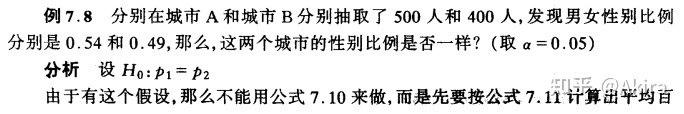

# ABtest背后的统计学原理

## **总体和样本**

在进行研究时，首先需要做的是确立研究对象，这就涉及到总体的确立和样本的选取。

 **总体（population）：** 具有共同的、可观测特征的一类事物的全体。

研究一个问题，最好的情况是对总体中的每个个体加以测量，但在实际研究中，往 往无法对整个总体进行研究，有的是无法办到，有的是人力财力的限制，有的是根本就没有必要。因此我们只能从总体中抽取一些个体作为真正的研究对象。从总体中选择 出的个体的集合，我们称之为 **样本(sample)** 。

 **随机取样(random sampling)** 是从总体抽取样本的一种策略，要求总体中的每一个个体被抽到的机会均等，用随机取样法得到的样本叫做随机样本。

只有对总总体的分布、特征等有了全面地认识，才可能选取恰当的随机取样方法，保证所抽取的样本在最大可能上具有同总体一致的分布和特征，达到采取随机方法所希望的效果。

##  **集中量数和差异量数**

###  **集中量数：**

  1. 平均值：首选，缺点：极端值影响
  2. 中位数：数据变动不灵敏，不受极端值影响
  3. 众数：代表性较差

###  **差异量数**

  1. 极差
  2. 标准差
    1. 离差 $=X-\mu$
    2. 和方 $ SS=\sum(X-\mu)^2=\sum X^2-\frac{(\sum X)^2}{N}$
    3. 总体的方差和标准差 $\sigma^2 = \frac{SS}{N}$$\sigma = \sqrt\frac{SS}{N}$
    4.  **样本** 的方差和标准差
      1. 推论统计的目标：希望利用来自样本的有限信息推测出有关总体的信息或结论。
      2. 一个必要前提：我们所选取的样本能很好的为代表总体的有关特征，即样本具有代表性。
      3. 但是，不可避免的是，样本的变异性(variability)往往比它所来自的总体的变异性要小。

由于样本变异性小于总体变异性，我们需要对总体的方差和标准差公式进行定的修正。

$ SS=\sum(X-\bar X)^2=\sum X^2-\frac{(\sum X)^2}{n}\\ S^2 = \frac{SS}{n-1}\\ S = \sqrt\frac{SS}{n-1}$ 

WHY 除以 n-1？  
---  
  
直观上：由于均值已经用了 n 个数的平均来做估计，在求方差时，只有(n-1)个数和均值信息是不相关的。而你的第ｎ个数已经可以由前(n-1)个数和均值来唯一确定，实际上没有信息量。所以自由度为（n-1）。

More math：[为什么样本方差（sample variance）的分母是 n-1？ - 茉茉的回答 - 知乎](https://www.zhihu.com/question/20099757/answer/13971886)

3\. 四分位数

##  **z 分数与正态分布**

###  **z 分数及其应用**

如果我们以均值作为一个参照点，在单个的分布中，我们可以利用离差来衡量每个 原始分数的位置。但是，如果我们想 **比较两个或多个分布中的原始分数的相对位置** ，离差就无法发挥作用了。

$ z = \frac{X-\mu}{\sigma}$ 

如果我们将一个分布中的所有原始分数转化为 z 分数，所得的新所分布就被称为 分数分布，也称标准分布(standardized distribution),并称此过程为标准化。

意义：

  1. 首先,z 分数可以代表 **概率** 。对于每个 z 分数都对应于固定概率的分布，如正态分布，我们只要知道了 z 分数的区间，便可推算出相应的概率。
  2. 其次,z 分数可以代表 **变量间的关系** 。对于身高和体重这两个不同的变量，我们只要知道了 z 分数，便可以比较它们和均值之间的距离远近，从而确定它们之间的相对关系。

###  **正态分布**

##  **样本均值的分布**

在实验中我们常常面临这样的问题：选取的样本能不能较好地代表总体呢?如下图,假设从同一总体中抽取三次不同 的样本，会发现每一个都不同，有不同的形状、不同的均值、不同的方差，那么，我们如何对总体的情况作出最好的估计?  
---  

###  **取样分布**

取样分布是参数或统计量（均值、方差、标准差、相关系数）的集合。

下面几种各是什么分布？

  1. 北京人口普查的结果，将其家庭成员个数作一次数分布。
  2. 在北京市民中随机抽取 3000 个家庭，将其家庭成员个数作一次数分布。
  3. 在北京市民中取样 100 次，每次随机抽取 30 个家庭，将 100 次的家庭成员平均个数作一次数分布。

###  **样本均值的分布**

样本均值的分布在形状上接近正态分布，尤其当 **总体是正态分布，或者样本量较大(30 以上）** 的时候，样本均值的分布几乎可以看作是完全的正态分布。

 **均值：** 无偏估计下，样本均值=总体均值=正态分布情况下样本均值分布的均值

 **标准差？标准误！** ：样本均值分布下衡量分布变异的指标

$\bar X 的标准误 = \sigma_{\bar X} = \bar X 与\mu 的标准距离 = \frac{\sigma}{\sqrt n}$ 

应该注意的是，虽然我们期望样本能够反映总体的性质，但是样本总是不能完全准确地代表总体，两者之间总会存在一定的误差。 **标准误** 就反映了样本均值和总体均值之间平均有多大的差异，反映了一个样本均值能多准确地代表其总体均值。

###  **大数定律**

一个盒子里有白色和黑色两种球，你从中抽取出了 2 个白色的球，或者从中抽取了 20 个白色的球，然后你都得出结论认为盒子中白色的球占大多数。哪种情况下你的判断更可信呢?

 **随着样本容量的增大，样本均值与总体均值之间的误差会减小。**

###  **z 分数**

我们同样可以用 z 分数来描述选取的一个样本在样本均值分布中的位置。

例如,z=-2.00 的这样一个 z 分数，表明选取的这个样本 均值远远小于期望值，它处于 X 的期望值以左的两个标准差外。而 z=0 的 z 分数则 表明选取的这个样本均值刚好等于总体的均值，它表示这个样本是位于中间的、有代表性的。

$$ z = \frac{\bar X-\mu}{\sigma_{\bar X}}$$

## **假设检验初步**

优秀教师评选：

A 老师：

  1. 最近一次统考，该班平均成绩比整个年级高了 10 分
  2. 最近一年，该班平均分比总平均分高了 1 分

当差异悬殊的时候，人们倾向于对 A 老师的实力表示信服;而当差异较小的时候，则倾向于将其归结于好运气。

样本均值和总体均值差异越小，由于随机抽样所致的概率越大。

 **假设检验(hypothesis testing)就是这样的一套推断程序，利用样本数据来评价关于目标总体的某一假设的可置信性。**

###  **假设检验的基本逻辑**

 **两种假设**

任何一种研究设计都仅有两种可能：

  1.  **符合我们的预期，自变量对因变量确实有作用（H1，备择假设）**
  2.  **处理效应其实不存在，我们所观见察到的差异只是随机误差（H0，虚无假设）**

 **决策标准**

  1. 假设检验的结论一般是针对 H0（所以 H1 被称为备择假设）
  2.  **证明一件事情不是真的比证明他是真的更容易** ——证伪所有昆虫都是六条腿，只需找出反例。
  3. 由于 **无法了解总体** ，因此尝试拒绝虚无假设优于证明备择假设。

我们假设 H0 是真实地，计算出我们观察的差异是由随机误差所导致的概率 P，与预先设定的显著性水平 alpha 比较。如果 P 小于等于 alpha 则拒绝 H0，反之则不能拒绝。

方向性：

###  **z 检验**

###  **两类错误**

  * 假设检验：根据样本信息推断总体情况和决策的过程
  * 由于样本所携带信息不全，一定可能出现错误

  * I 类错误：又叫 $\alpha $ 错误，“无中生有” “冤枉好人”
  * 概率：$\alpha $ 
  * II 类错误：又叫 $\beta $ 错误，“失之交臂” “漏网之鱼”
  * 概率：$\beta $($ 1-\beta $ 就是正确拒绝一个错误的虚无假设的概率，称为 **效力（power）** )

  * 影响效力的因素：处理效应大小，检验的方向性， **样本容量**

##  **二项分布**

我们以 n 来表示样本中所包含个体（或观察）的数目，而 X 为样本中事件 A 发生 的数目，那么，在 n 次观察中，事件 A 发生的总次数 X 就是 **二项变量** ,X 的概率分布就叫 **二项分布** 。自然,X 的可能取值为 0,1,2,.....n,二项分布表达了与从 X=0 到 X=n 的每一个 X 值有关的概率。

 当 n 足够大（pn>10 和 qn>10）时，二项分布可以近似为正态分布
---  
  
  * 均值： $μ = pn $ 
  * 标准差： $\sigma = \sqrt{pqn}$ 

### **百分比检验**

从一个城市的居民中抽取一部分，其中男性的比例是 60%，那这个城市居民的性别比例是多少？

 **用样本比率估计总体比率：样本比率** $ p'$ , **总体比率** $ p $ 

从一个总体去除样本为 $ n $ 的样本时，样本中事件 A 发生的次数 $ X $ 服从二项分布，则其比率也服从二项分布：

$ p' = \frac{X}{n}\\ \mu_p = \frac{pn}{n} = p\\ \sigma_p = \frac{\sigma}{n} = \frac{\sqrt{npq}}{n} = \sqrt{\frac{pq}{n}} = \sqrt{\frac{p'q'}{n}}$

###  **两总体的百分比检验**

在 AB test 中，我们常用的并不是样本与总体的百分比检验，而是：

我们知道两个样本的百分比率，要由此推断出两个样本所代表的总体的情况，即样本背后的之间差异是否显著。  
---  
  
$\mu_{p1-p2} = p1 - p2\\ \sigma_{p1-p2} = \sqrt{\frac{p_1q_1}{n_1}+\frac{p_2q_2}{n_2}} = \sqrt{\frac{p'_1q'_1}{n_1}+\frac{p'_2q'_2}{n_2}}$

  

注意：当两个样本来自同一总体时，即 p1=p2 时,不能采取该方法计算标准误。  
---  
  
$\bar p = \frac{n_1}{n_1+n_2}p'_1+\frac{n_2}{n_1+n_2}, p'_2 = \frac{n_1p'_1+n_2p'_2}{n_1 + n_2}$ 

$\sigma_{\bar{p}} = \sqrt{\bar{p}\bar{q}\frac{n_1+n_2}{n_1n_2}}$

###  **样本量计算：**

[Sample Size Calculator (Evan’s Awesome A/B Tools) (evanmiller.org)](https://link.zhihu.com/?target=https%3A//www.evanmiller.org/ab-testing/sample-size.html)

 **Baseline Rate**

这个看的是在实验开始之前，对照组本身的表现情况。在我们的实验里，baseline 就是红色按钮的历史点击率。从直观上我们可以这么理解 baseline：

  * 当 baseline 很大（接近 1）或者很小（接近 0）的时候，实验更容易检测出差别（power 变大），如果保持 power 不变，那么所需要的样本数量变小。举个例子，假设红色按钮的点击率是 0%。那么，哪怕绿色按钮只有一个用户点击，相对于对照组来说也是挺大的提升。所以即便是微小的变化，实验也会更容易地检测出来。
  * 同理，当 baseline 居中（在 0.5 附近徘徊）的时候，实验的 power 会变小。

在工作中，这个参数完全是历史数据决定的。在我们的实验中，我们假定，实验开始之前的历史点击率是 40%。所以 Baseline Rate=40%。

 **Minimum Detectable Effect**

顾名思义，这个参数衡量了我们对实验的判断精确度的最低要求。

  * 参数越大（比如 10%），说明我们期望实验能够检测出 10%的差别即可。检测这么大的差别当然比较容易（power 变大），所以保持 power 不变的情况下，所需要的样本量会变小。
  * 参数越小（比如 1%），说明我们希望实验可以有能力检测出 1%的细微差别。检测细微的差别当然更加困难（power 变小），所以如果要保持 power 不变的话，需要的样本量会增加。

在工作中，这个参数的选定往往需要和业务方一起拍板。在我们的实验中，我们选定 Minimum Detectable Effect=5%。这意味着，如果绿色按钮真的提高了点击率 5 个百分点以上，我们希望实验能够有足够把握检测出这个差别。如果低于 5 个百分点，我们会觉得这个差别对产品的改进意义不大（可能是因为点击率不是核心指标），能不能检测出来也就无所谓了。

###  **两独立样本的均值 z 检验**

 **此时必须有总体方差已知，若未知，则需按照 t 检验进行计算。**

##  **卡方检验**

检验是用样本数据来 **检验总体分布的形状或比率** ，以确定与假设的总体性质的匹配度,它是对分布的检验。例如，我们要考查以下问题：在医生职业中，男的多还是女的多?在 A,B,C 三种咖啡中，哪种最被中国人喜欢?在一所大学中，各国留学生的比例有代表性吗?

当比较的组别数为 2 时，卡方检验等价于两总体的百分比 z 检验！  
---  
  
假设我们的 A/B Testing 测试目标是 APP 新使用者隔日再上线比例的留存率数据。在 A 与 B 两组各搜集四万人样本之后，得到如下结果：

组别| 隔日未上线人数| 隔日再上线人数  
---|---|---  
A 组| 24,035| 15,965  
B 组| 23,762| 16,238  
  
A 组的次日留存率是 39.9%、B 组则是 40.6%，到底 0.7% 的差异能不能做出「B 组表现比较好」的结论，我们需要统计检定的帮忙才能决定。如果要比较 A 与 B 组谁的隔日再上线比例较高，该用什么统计检验呢？

###  **z 检验** 

$ p_{pooled} = \frac{15965+16238}{40000+40000} = 0.4025375 \\ z = \frac{p_2-p_1}{p_{pooled}(1-p_{pooled})(\frac{1}{n_1}+\frac{1}{n_2})} = \frac{\frac{16238-15965}{40000}}{0.4025(1-0.4025)(\frac{2}{40000})} = 1.968154$

###  **卡方检验（自由度为=（行数-1）x（列数-1））**

$e_{success} = 40000 \times \frac{15965+16238}{40000+40000} = 40000 \times 0.4025375 = 16101.5\\ e_{failure} = 40000 \times (1-e_{success}) = 40000 \times 0.5974625 = 23898.5$

$\chi^2 = \frac{(24035-23898.5)^2}{23898.5}+\frac{(23762-23898.5)^2}{23898.5}+\frac{(15965-16101.5)^2}{16101.5}+\frac{(16238-16101.5)^2}{16101.5} = 3.873632 $

###  **假设不同**

Z 检验（双尾）：

  * 虚无假设：A 与 B 两组，次日留存率相同
  * 备择假设：A 与 B 两组，次日留存率不同

卡方检验（独立性检验）：

  * 虚无假设：“隔日是否再上线”与“使用者为 A 或 B 组”两变量无关系
  * 备择假设：“隔日是否再上线”与“使用者为 A 或 B 组”两变量有关系

###  **实验设定不同**

两项检定的实验设定差异在于：比较比例的两个群体是否 **来自同一个总体** 。

使用 Z 检验时，样本是 **分别来自** 两组不同总体。例如：进行两个国家的问卷调查，美国搜集 1000 人样本、日本搜集 1000 人样本。

使用卡方检验比较比例数据时，资料来自 **同一个母体** ，我们观察的是其中的两个变量的关联性。例如：同一间医院的所有病患样本，检验「是否吸烟」与「是否得肺癌」之间的关联性。

卡方检验也可以直接在网站上进行：  
---  
  
[Chi-Squared Test (Evan’s Awesome A/B Tools) (evanmiller.org)](https://link.zhihu.com/?target=https%3A//www.evanmiller.org/ab-testing/chi-squared.html)

(作者收集整理于网上，仅供交流学习使用，侵删)

