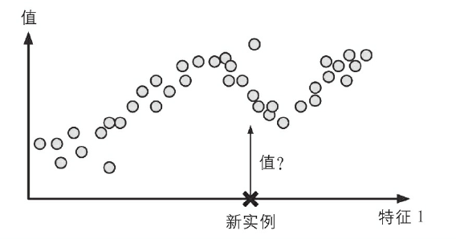
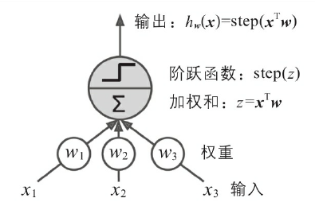
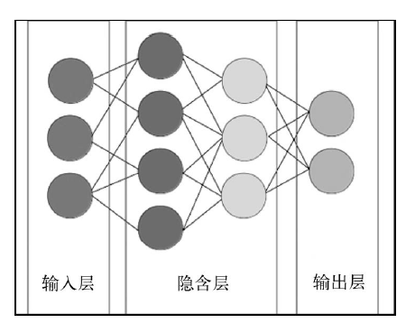

# 深度学习的宏观经济学前景

宏观经济理论模型经过长时间的发展，目前被认为具备如下几个关键要素：（1）它基于家庭和企业基于微观经济理论所做出的理性决策；（2）它是动态的，因此储蓄和投资等决策由跨期所决定；（3）它具备一定的随机性，使得经济面临正向或负向的冲击；（4）它考虑一般均衡，因此要素价格和利率是内生决定的；（5）它具备一定的异质性。比如考虑家庭的财富具备一定程度的差异，那么在不完备市场下，个体的风险就不能获得完全保险，家庭便产生预防性储蓄行为。这表明不同财富水平的家庭往往具备不同的边际消费倾向，那么受到同样的宏观经济政策的影响也会不同。前四个要素在目前国内外绝大多数的模型中都是必不可少的，并且在学界也形成了标准的分析框架进行研究。而目前最前沿和最重要的研究方向则在于第五个要素——异质性。

异质性模型的发展首先得益于微观行为数据库的完善，我们可以得到一个经济体中如家庭财富或企业规模的分布。其次则在于求解方法的提出。目前有两种主流的方法用于求解包含总体冲击的异质性代理人（Heterogeneous Agent，以下简称HA）模型。第一种是Krusell-Smith（KS）方法，这是Krusell & Smith（1998）提出的一种全局求解方法，后被大量文献广泛应用（Den Haan（2010）， Fern´andez-Villaverde et al.（2019）， Schaab（2020））。KS方法利用模型的低阶矩（如均值或者方差）来近似代理人的分布。它在求解简单的HA模型时很有效，但在面临多个冲击或者多个内生状态变量时效率较低。这是因为在引入过多变量（或更高阶的矩）时产生的维度诅咒问题（Bellman，1961），使得计算的成本随着变量的数量呈指数级别增长。

第二种方法是Reiter（2009）提出的局部扰动法。这种方法可以用来研究复杂的HA模型，但是并不适用于那些总体冲击会带来显著的非线性或者非局部效应的模型（Winberry（2018）; Ahn et al.,（2018）， Boppart et al.（2018），Auclert et al.（2021））。而非线性效应在零利率下限（ZLB）的模型中则非常常见，非局部效应在出现在具有较大总体冲击或总体的不确定性对个体行为产生重大影响（如宏观金融模型）的模型中，导致风险稳态与确定性稳态出现偏差。

模型特性|	KS方法|	微扰法
--|--|--
大量冲击|	不适用|	适用
大量内生状态变量|	不适用|	适用
冲击效应大|	适用|	不适用
风险稳态|	适用|	不适用
非线性（如ZLB）|	适用|	不适用

这两种非线性的求解方法各有优劣，总的来说，我们更偏好一种全局求解的方法，然而无论是上面提到的KS方法还是较为通用的动态规划（值函数迭代）方法，都难以避免维度诅咒问题。事实上，维度诅咒主要由三个方面引起（Powell，2007）。第一个在于对高维非线性函数的逼近，第二个是在离散问题的贝尔曼方程中涉及期望的计算，最后一个则在于最优策略的选择。过去的六十多年里，已经有不少学者针对这一问题提出了优化，比如稀疏网格法（Sparse Grids，具体有Krueger and Kubler(2004)，Judd et al. (2014)， Brumm and Scheidegger (2017)），但其本质上是一种数学上的优化处理，对于具有30个以上状态变量以及一些不可微分形式的问题无能为力。

然而这一问题在随着人工智能的发展得到了突破。人工智能领域中一个非常重要的方向是有监督学习（Supervised Learning），其目的是在有标签的数据集下对模型进行训练，以用于对新数据进行标记（Goodfellow et al. ,2016）。根据模型输出值的不同，可以将任务分为分类（输出离散值）和回归（输出连续值）两类。 

从上图可以看到，有监督学习的本质是建立一个预测函数，对于数据点进行拟合。而预测函数的形式则由选择的方法来确定。如果采用线性回归（Linear Regression）模型，则预测函数便是数据点特征的线性组合； 如果采用决策树（decision tree）模型，则预测函数便是分段的指示函数（indicator function，满足某些条件为1，否则为0）。

而近年来最为流行的算法便是神经网络，或者说“深度学习” (深度学习是一类具备许多层数的大型神经网络，经验表明，相同神经元的情况下，层数多的网络性能要优于层数较少的（Goodfellow et al. ，2016）。)。神经网络的基本单位是神经元，神经元按照层级进行排列。第一层，也就是输入层，接收来自数据集的输入。第一层中的每个神经元对输入进行加权和以及激活函数（也被称为阶跃函数）计算，把得到的结果传给第二层的神经元，这样上一层的输出作为下一层的输入，直至到达输出层。

由于激活函数的存在，神经网络的预测函数具备了非线性的特点。事实上，如果激活函数对输入不加任何操作，那么这样的神经网络就是一个简单的线性回归模型；如果考虑一个一层的，激活函数为Logistic函数的神经网络，那么其本质上就是一个Logistic回归模型。而Horik et al.（1989）已经证明，只要神经元数目足够多(Leshno et al. (1993)则追加了激活函数不能为多项式（包括线性整流函数，ReLu）这一条件。)，神经网络可以以任意精度逼近有限维的Borel可测函数，这一结论被称为全局逼近定理（Universal Approximation Theorem）。

而求解大部分宏观模型的本质，就是对值函数、策略函数等与状态变量相关的函数进行近似，这与有监督学习中对预测函数的近似是殊途同归的。无论是局部扰动法还是KS方法中的投影法，本质都是一种函数近似。而神经网络恰恰是一种非常好的非线性函数近似器，那么他是否会对解决“维度诅咒”问题有帮助呢？答案是肯定的。 Barron（1993）的研究指出在近似精度固定的情况下，逼近函数所需要的神经元数量随着神经网络的维数呈线性增长，而对于一般的级数逼近，其基函数的需要则呈指数级增长。这就表明神经网络模型与同样是全局近似的投影法相比可以打破“维度诅咒”，其背后原因在于投影法的近似函数是一些复杂基函数的相加，而神经网络则是简单神经元的复合，后者的微分计算对于计算机来说更为简单。

近五年来，大量学者研究将神经网络作为全局近似器来解决异质性问题（Azinovic（2019），Duarte（2018），Villa and Valaitis (2019)，Maliar et al.(2021)，Fern´andez-Villaverde et al. (2020)，Han et al.(2022)）。尽管这些文献核心上都对使用深度学习这一方法达成共识，但在细节的处理上却大相径庭。其原因有二，一是深度学习算法本身具有极强的可操作性和多重可实现性，针对同一类问题，有无数种不同的神经网络可以解决，因此我们往往更加关心不同深度学习框架的效率和稳健性；二则在于，之前提到的“维度诅咒”分为三个方面，深度学习的出现仅仅解决了第一个方面——高维非线性函数的逼近，而对于期望积分的计算和策略的选择问题同样需要优化，已有文献中所采用的方法有将离散问题转换为连续问题，或将深度学习与强化学习（Reinforcement Learning）以及无监督学习方法结合等。

此外，计算机领域和业界的深度学习发展也为其在经济领域应用提供了很多便利。谷歌和Facebook等公司已经开源了他们的深度学习框架，研究者只需要一些基本的编程技能便能架构自己的模型，深度学习的使用门槛已经大幅降低。同时随着计算机硬件的发展，TPU，AI加速器，FPGA以及利用GPU并行化运算的技术也加速了大规模神经网络的学习速度。可以预见，深度学习在求解大规模异质性代理人模型中将发挥日益重要的作用，甚至于成为为主流算法。
	
## 参考文献

AHN S, KAPLAN G, MOLL B, 等, 2018. When inequality matters for macro and macro matters for inequality[J]. NBER macroeconomics annual, 32(1): 1–75.

AUCLERT A, BARDÓCZY B, ROGNLIE M, 等, 2021. Using the sequence-space Jacobian to solve and estimate heterogeneous-agent models[J]. Econometrica, 89(5): 2375–2408.

AZINOVIC M, GAEGAUF L, SCHEIDEGGER S, 2019. Deep equilibrium nets[J]. Available at SSRN 3393482.

BARRON A R, 1993. Universal approximation bounds for superpositions of a sigmoidal function[J]. IEEE Transactions on Information theory, 39(3): 930–945.

BOPPART T, KRUSELL P, MITMAN K, 2018. Exploiting MIT shocks in heterogeneous-agent economies: the impulse response as a numerical derivative[J]. Journal of Economic Dynamics and 
Control, 89: 68–92.

BRUMM J, SCHEIDEGGER S, 2017. Using adaptive sparse grids to solve high-dimensional dynamic models[J]. Econometrica, 85(5): 1575–1612.

DEN HAAN W J, 2010. Comparison of solutions to the incomplete markets model with aggregate uncertainty[J]. Journal of Economic Dynamics and Control, 34(1): 4–27.

FERNÁNDEZ-VILLAVERDE J, HURTADO S, NUNO G, 2019. Financial frictions and the wealth distribution[R]. National Bureau of Economic Research.

FERNANDEZ-VILLAVERDE J, NUNO G, SORG-LANGHANS G, 等, 2020. Solving high-dimensional dynamic programming problems using deep learning[J]. Unpublished working paper.

GOODFELLOW I, BENGIO Y, COURVILLE A, 2016. Deep learning[M]. MIT press.

HAN J, YANG Y, OTHERS, 2022. DeepHAM: A Global Solution Method for Heterogeneous Agent Models with Aggregate Shocks[J].
HORNIK K, 1991. Approximation capabilities of multilayer feedforward networks[J]. Neural networks, 4(2): 251–257.

JUDD K L, MALIAR L, MALIAR S, 等, 2014. Smolyak method for solving dynamic economic models: Lagrange interpolation, anisotropic grid and adaptive domain[J]. Journal of Economic Dynamics and Control, 44: 92–123.

KAHOU M E, FERNÁNDEZ-VILLAVERDE J, PERLA J, 等, 2021. Exploiting symmetry in high-dimensional dynamic programming[R]. National Bureau of Economic Research.

KRUEGER D, KUBLER F, 2004. Computing equilibrium in OLG models with stochastic production[J]. Journal of Economic Dynamics and Control, 28(7): 1411–1436.

KRUSELL P, SMITH A A Jr, 1998. Income and wealth heterogeneity in the macroeconomy[J]. Journal of political Economy, 106(5): 867–896.

LESHNO M, LIN V Y, PINKUS A, 等, 1993. Multilayer feedforward networks with a nonpolynomial activation function can approximate any function[J]. Neural networks, 6(6): 861–867.

MALIAR L, MALIAR S, WINANT P, 2021. Deep learning for solving dynamic economic models.[J]. Journal of Monetary Economics, 122: 76–101.

POWELL W B, 2007. Approximate Dynamic Programming: Solving the curses of dimensionality[M]. John Wiley & Sons.

REITER M, 2009. Solving heterogeneous-agent models by projection and perturbation[J]. Journal of Economic Dynamics and Control, 33(3): 649–665.

SCHAAB A, 2020. Micro and macro uncertainty[R]. Working Paper.

VILLA A T, VALAITIS V, 2019. Machine learning projection methods for macro-finance models[J]. Economic Research Initiatives at Duke (ERID) Working Paper Forthcoming.

WINBERRY T, 2018. A method for solving and estimating heterogeneous agent macro models[J]. Quantitative Economics, 9(3): 1123–1151.

