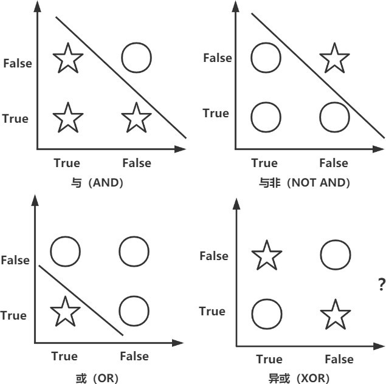
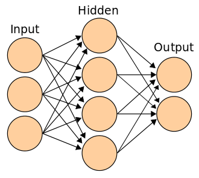

# 计算主义的发展与人工智能现状

## **一、 引言**

早期人们对心智问题的研究，基本是内省的感悟，这个感悟构建的心理学独立于物理世界之外，其哲学背景是一种心身二元论。而二元论的种种观点在各种批判下开始逐渐衰落，到了 20 世纪，行为主义开始流行，不讲主观感觉只重客观行为，观察人的外在表现和倾向，不在乎所谓的心理解释。但正如乔姆斯基（Chomsky）所言，“研究心理学时只研究行为，就如同研究物理学时之研究仪表盘上的数据一样可笑”[[7](https://zhuanlan.zhihu.com/p/386692936/edit#_bookmark5)]。在 20 世纪下半叶，行为主义逐渐被物理主义所取代，人们的将探讨重点放在了“同一性理论”（Identity Theory）。而随着计算机科学等的发展，普特南（Putnam）在图灵机的启发下于 1967 年提出了功能主义[[6](https://zhuanlan.zhihu.com/p/386692936/edit#_bookmark4)]，成为心灵和智能研究的主流，这也被塞尔（Searle）称为“对心灵问题思考具有关键意义的行动”[[7](https://zhuanlan.zhihu.com/p/386692936/edit#_bookmark5)]。

功能主义的一个核心概念便是“多重可实现”（Multiple Realization），这一基本的思想其实从“个例同一论”的出现便有所体现，但是由普特南首次将其提出，并有力地驳斥了“类型同一论”。“多重可实现”指出：心灵的状态不是大脑的特定状态，而是一种功能作用。同一种功能可以被许多不同的物理状态实现。这便是人工智能的哲学根源所在，既然人脑可以具有心智，那么机器是否可以同样具有智能呢？

计算主义从某种意义上给出了解答。其认为：脑是一个计算机，而心灵是一个程序或程序系列，所谓心理状态、心理活动和心理过程不过是智能系统的计算状态、计算活动和计算过程。计算主义与功能主义之间一直保持着十分密切的相互支撑关系。功能主义为计算主义提供本体论说明，计算主义为功能主义提供方法论依据。因此计算主义最完整的表述是“计算机功能主义”，它系统表达了计算主义的本体论状态和方法论基础[[1](https://zhuanlan.zhihu.com/p/386692936/edit#_bookmark1)]。功能主义实际上是承诺了关于心智的黑箱观点，而计算主义则说明，黑箱中发生的就是计算。计算主义也完全符合心智的多重可实现性。而计算主义发展至今，已经出现了多种理解和表现形式，如福多（Fodor）等人的“计算和表征理论”，纽厄尔（Newell）和司马贺（Simon）的“符号主义”（Symbolicism）以及“联结主义”（Connectionism），本文重点讨论的为在当今人工智能领域应用更为广泛的后面二者。

##  **二、 经典的计算主义——符号主义**

“符号主义”（Symbolicism），又称逻辑主义 (Logicism)，主张用公理和逻辑体系搭建一套人工智能系统。符号主义认为，人脑通过抽象的符号表征所有经验，并通过符号加工的方式处理所有经验，也就是说符号主义完全专注于句法（Syntax）的操作，而忽视了语义（Semantics），对符号主义最著名的批判便是我们课堂上展示并讨论的塞尔的“中文屋”思想实验也是针对这一点而提出的——一个只专注于符号操作看上去会“中文”的人，并不真正知道它的具体含义，这里便不再额外讨论。

同时对符号主义另外一种批判来自于数学家哥德尔（Kurt Gdel）的证明，其于 1931 年发表了著名论文《论数学原理和有关系统 I 的形式不可判定命题》，提出了所谓的不完备性定理：任何包含了算术的一致的形式系统，都存在着不可判定的命题，即永远都会有公理以外的东西。简而言之，就是不管列出多少条规则，总有内容不能被囊括其中。而符号主义恰恰需要我们制定规则，也就是说中文物当中的

“字典”必须得是非常完备且准确的，这样才不至于在回答问题时“露馅”。蔡恒进（2020）也从“阿基里斯悖论”给出了一种例子，之所以人们在论证过程正确的情况下却得到了阿基里斯永远都追不上乌龟这样的悖论，便是由于我们的思考系统时给时间设置了边界[[2](https://zhuanlan.zhihu.com/p/386692936/edit#_bookmark2)]，那么符号主义的边界，便是我们预先设定的“规则”，符号主义的失败也是由于其没法做到囊括所有的规则，其所创造的系统始终是有边界的。

符号主义在人工智能领域的应用被称为“符号人工智能”，其最辉煌的时期莫过于上世纪六七十年代的“专家系统”（Expert System），他能够在某一特定领域模拟人类专家的回答，其主要由知识库和推理引擎两部分组成。知识库便是关于事实的基本阐述，而推理引擎便是以类似“If-Then 语句的关系”来连接符号。专家系统会使用人类可读的符号来处理规则，借此进行推论，并确定还需要哪些其他信息， 也就是还要问什么问题。

几年前玩过一个十分有趣的小游戏《网络天才（Akinator）》，你需要做的就是在脑海中想一个人物（无论他是真实或者虚拟），然后回答游戏提出的有关于这个人物的问题，你可以选择“是、否、不知道、或许是、或许不是”，在经过一系列问题后，游戏往往能准确无误地猜出你所想的人物（甚至如果你胡乱选择，游戏也会“告诉”你不要戏弄他）。一开始玩的时候或许会感到大吃一惊，但这其实就是一个经典的专家系统，每一个人物都被分解成众多特征作为符号储存在这个游戏里，随后这个系统所需要做的就是根据你的回答对其进行筛选，直到它可以将目标人物锁定。但如果我将系统所能提问的最大个数限制，那么这个专家系统恐怕便不能够准确回答出我心中所想，甚至很难给出不同候选人的概率，因为那些候选人物其实都符合固定步骤的所有规则，在符号主义的视角下都是等价的，这其实也是符号人工智能的一种局限性。

目前纯粹的“符号人工智能”已经相当少见，我个人认为主要原因在于知识库维护更新过程的繁重， 导致投入和产出不成正比，第二个原因在于随着互联网的发达，对于简单规则下的理解，人们可以直接使用搜索引擎进行上网解决，而过于复杂的推理引擎仅依靠符号系统不仅准确率极低，而且研发过程较为困难，一个成熟的系统通常需要与神经网络、深度学习等”联结主义“相结合。

##  **三、 东山再起——联结主义**

联结主义（Connectionism），又叫仿生学派，主张模仿人类的神经元（尽管这是大多数人的观点，事实上从神经学的观点来看，神经元的轴突之间的传播并不能做到“反向传播”，但这恰恰是人工神经网络的核心，因此二者只是在结构上相似，原理上并不相同。），用神经网络的连接机制实现人工智能。他与符号主义几乎同时出现，但核心在于符号主义所理解的计算是符号计算，故常被称为神经计算模型。同样作为计算主义的延伸，其本质上并没有逃脱塞尔对于其中缺乏“语义”方面的质疑。课堂上我们讨论了网络发音器模型“NETtalk”, 尽管它在认识和模拟人脑功能上有出色表现，但某种情况下英语发音依赖于词意，这是其无法理解的。

联结主义的模型最早于 1943 年由生理学家麦卡洛克 (McCulloch) 和数理逻辑学家皮茨 (Pitts) 提出， 他们认为，神经元的运作过程和神经元之间的关系，可以用数理逻辑运算的方式加以描述，例如神经元可以被激活，又可激活别的神经元。随后，又进而产生了感知器这一神经网络的核心概念（对于感知器的解释，有兴趣的读者可以自行搜索，在此不再赘述，只需要理解它可以根据输入参数的值来判断是否激活（1）或不激活（0）。）。感知器的独特之处在于：它既有自身的体系结构，又有计算机制，具有一些优于经典计算主义的地方，在六十年代早期受到了很多计算主义学者的亲睐。

但遗憾的是，马文·明斯基（Marvin Minsky）这一“符号主义”的代表人物和麻省理工学院的佩珀特（Seymour Papert）合著了《感知机：计算几何学》一书，指出了“感知机”存在的缺陷——感知机缺乏一般性，从本质上说无法实现全局的优化，因为单层感知器解决非线性问题的能力太差。笔者画了个简单的例子如下：

可以发现，在简单的逻辑词：与（AND）、与非（NOT AND）、或（OR）时，单层的感知器都可以用一条直线去区分是否被“激活”，但面对异或（XOR）（异或：二者相同时返回 True，不相同时返回 False。）这样的高阶逻辑词，单层感知器便没法用线性 的函数将其区分，便也无法判断。同时在当时生物模型和硬件条件的限制下，多层感知器也并没有办法开展实践，在诸多因素的影响下政府资助机构逐渐停止了对神经网络研究的支持，联结主义逐渐走向没落。

直到 1982 年，霍普菲尔德（Hopeld）提出了一种新的神经网络，可以解决一大类模式识别问题，还可以给出一类组合优化问题的最优解，联结主义又逐渐有了起色。而随着超大规模集成电路和电子计算机技术的发展，鲁梅尔哈特等人（Rumelhart）对多层感知器进行改进，提出了大名鼎鼎的反向传播算法（Backpropagation，BP）有了当今神经网络的雏形，同时该小组又以并行分布式处理（Parallel Distributed Processing，PDP）之名，出版了两卷著作，其主要观点我们在课堂上也进行过探讨，即基本单元通过巨大的网络连接在一起，而知识不是简单存储的，而是依靠权重来表示，如图[3](https://zhuanlan.zhihu.com/p/386692936/edit#_bookmark0)。目前各种前沿的神经网络模型几乎都是在此基础上进行改进，所谓的深度学习无非是让神经网络的层数更多一点罢了。

而权重确定的过程便是神经网络最迷人但也是最致命的点——学习，“学习”的迷人之处在于其完全克服了静态的“符号主义”下系统始终有界的问题，联结主义下的系统是一个随着学习不断更新的过程。但其致命的原因也就在于，其规则的确定需要数据或者说样本供其学习，而不能仅靠直接进行逻辑判断，如果样本量过少则完全没有用武之地。目前神经网络需要克服的最大的问题之一便是冷启动（类似的概念还有数据的稀疏性，这主要指的是数据之间的关系较少，而不是指数量。）， 即如何在初始数据稀少的情况下确定节点的权重。

除了对数据的需求外，联结主义相比符号主义更缺乏对于“黑箱”的探讨，如果说符号主义下的“黑箱”是机器根据我们所设定规则的逻辑推演，那么联结主义下的黑箱只是系统运行下产生的一堆无意义的数字罢了，其具体有什么含义对我们而言不得而知，这也是计算机领域认为神经网络“可解释性”较差的原因。

##  **四、 人工智能的未来——神经符号人工智能？**

MIT-IBM 沃森人工智能实验室主任 David Cox 首次提出了神经符号人工智能的概念，所谓神经符号人工智能，其实就是把以上两种方法结合起来，把学习和逻辑结合起来。其小组开发的一种混合系统——神经符号概念学习器 (NSCL) 便是使用基于规则的程序和神经网络来解决视觉问题。他可以帮助符号人工智能系统变得更聪明——通过神经网络将事实分解成符号，而不用依靠人工。同时，符号人工智能算法可以结合常识推理和行业知识，将其运用到神经网络中，其相比传统的神经网络就可以用更少的数据学习新任务，并且可解释性也会更强。

然而这样的结合仍然只是技术上的实现，对于机器是否可以具有真正意义的“智能”，“强个人工智能”是否存在，仍然逃不出塞尔关于计算主义“语义”和“句法”的经典批判，而提出机器功能主义的普特南本人也于 1973 年放弃了把心理状态可还原为图灵机状态的主张，其更加重视了认知过程中社会因素的影响，而机器本身没有办法解释具有社会属性的人的心理状态[[4](https://zhuanlan.zhihu.com/p/386692936/edit#_bookmark3)]。但正如计算主义的发展历程一样，技术和理论的进步是相互促进，协同发展的，在当今理论的探讨有所停滞的情况下，我们可以期待于技术的进步为理论打开新的思路。

 _后记: 事实上，人工智能领域还有另外一种流派：行为主义（Actionism），又称为进化主义（Evolutionism）或控制论学派，其通过对系统控制论的应用，使程序可以根据环境进行快速的反应，这一思想似乎与心理学以及哲学概念中的“行为主义”有所类似，但本质上仍然应该被划归为机器功能主义，其 是通过给定环境、个体以及个体决策的所有信息，通过算法对个体的反应进行模拟，更像是符号主义的一种衍生。我本人有所涉猎的强化学习的一个核心概念：动态规划，相当于把一个长期的最优化问题， 拆分成一个个两期的小问题进行解决，这种递归分解的思想恰恰就是经典计算主义所囊括的。_

##  **参考文献**

  1. 李建会, 夏永红. 心灵的形式化及其挑战：认知科学的哲学[M]. 北京: 中国社会科学出版社, 2017.
  2. 蔡恒进. 行为主义, 联结主义和符号主义的贯通[J]. 上海师范大学学报: 哲学社会科学版, 2020, 49(4): 87-96.
  3. 费定舟, 等. 心灵即计算: 哲学, 逻辑和实践[D]. 2009.
  4. KIM J. Philosophy of mind[M]. [S.l.]: Routledge, 2018.
  5. PUTNAM H. Minds and machines[J]., 1960.
  6. PUTNAM H. Psychological predicates[J]. Art, mind, and religion, 1967, 1: 37-48.
  7. SEARLE J R. Mind: A brief introduction[M]. [S.l.]: oxford university press, 2004.

